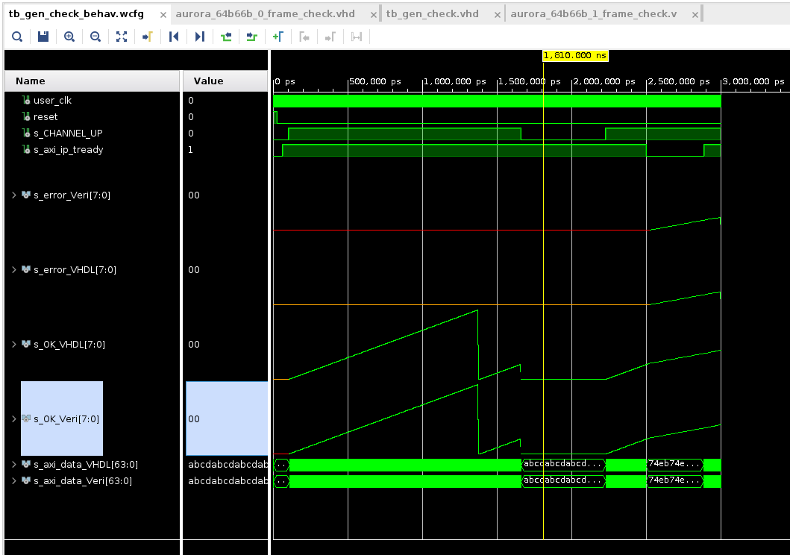

# aurora_64b66b-vhdl-sim
VHDL files to simulate the Aurora 64b66b protocol in Xilinx Vivado

---

This repository contains two testbenches to compare the behaviour of the original Verilog example design to the translated VHDL example.
The example consits of a FRAME_GEN and a FRAME_CHECK entity.
The FRAME_GEN uses a linear feedback shift register (LFSR) to generate "random" data. This data is assembled into a protocol data unit (PDU) and sent to the AXI bus where it will be transmitted using the GTY transceivers.
The FRAME_CHECK is on the receiving end of the AXI bus and takes PDU frames.
The PDU frames are then compared to another LFSR to check for transmission errors.

The testbench is self checking, meaning that it will produce an error message if any of the signals between the Verilog and VHDL version differ.

Known issues:
- The stiumulus of the signals is chosen to represent different things that could happen. They are not at all according to any specifications.
- While the simulation does not show any errors betwenn Verilog or VHDL, the FRAME_CHECK will be implemented differently in H/W and falsely detect a transmission error approximately every 10 transmissions.

